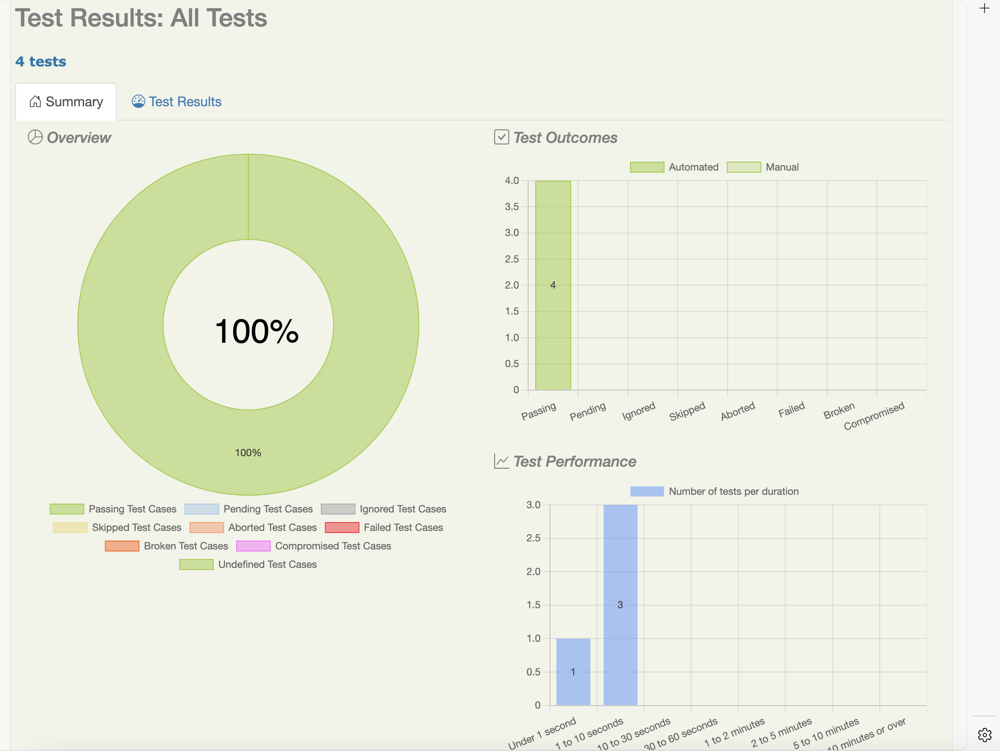
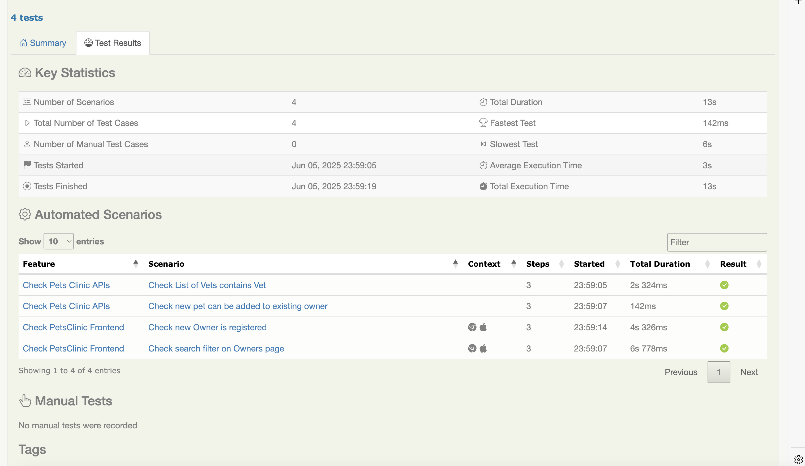

# Testing the API PetClinic using Serenity and Cucumber

This assignment is testing the PetClinic application.

## Get the code

To get the code from GitHub, run the following:

git clone ...


## The project directory structure
The project can be built with Maven and has the following directory structure:
```Gherkin
src
  + docs
  + test
    + java                                Test runners and supporting code
    + resources
      + features                          Feature files

          + petclinic
```

## Test scenarios
The project comes with four scenarios - 2 for API tests and 2 for frontend tests:
```Gherkin
  Scenario: Check List of Vets contains Vet
    Given the status of the API is 200
    When I make a request to the vets end-point
    Then the API response should contain "Leary"
```

This API test scenario tests that vet 'Leary' is present in the response of `http://localhost:8080/#!/vets` end-point. 

```Gherkin
  Scenario: Check new pet can be added to existing owner
    Given that owner with id "1" is present
    When I add a new pet with name "Aladin" for owner with id "1"
    Then pet "Aladin" will show in the list of pets for owner with id "1"
```
This API test scenario tests that a newly added pet "Aladin" is present in the response body of `http://localhost:8080/owners/1` end-point, which lists the details and the pets of owner with id '1'. 

```Gherkin
  Scenario: Check search filter on Owners page
    Given I am on Owners page
    When I enter "George" in search filter box
    Then I should see a list with 3 matching results
```
This frontend test scenario checks that by searching with "George" in the search filter, you get a list with 3 matching results. 


```Gherkin
  Scenario: Check new Owner is registered
    Given I am on Register owner page
    When I fill in data for an owner named "Anton" and Submit
    Then I should see "Anton" in the Owners page
```
This frontend test scenario verifies that registering a new owner named "Anton" results in seeing that owner in the list of owners.


## Test report

You can generate full Serenity reports by running `mvn clean verify` command.




Below are the tests included in the scenarios: 


